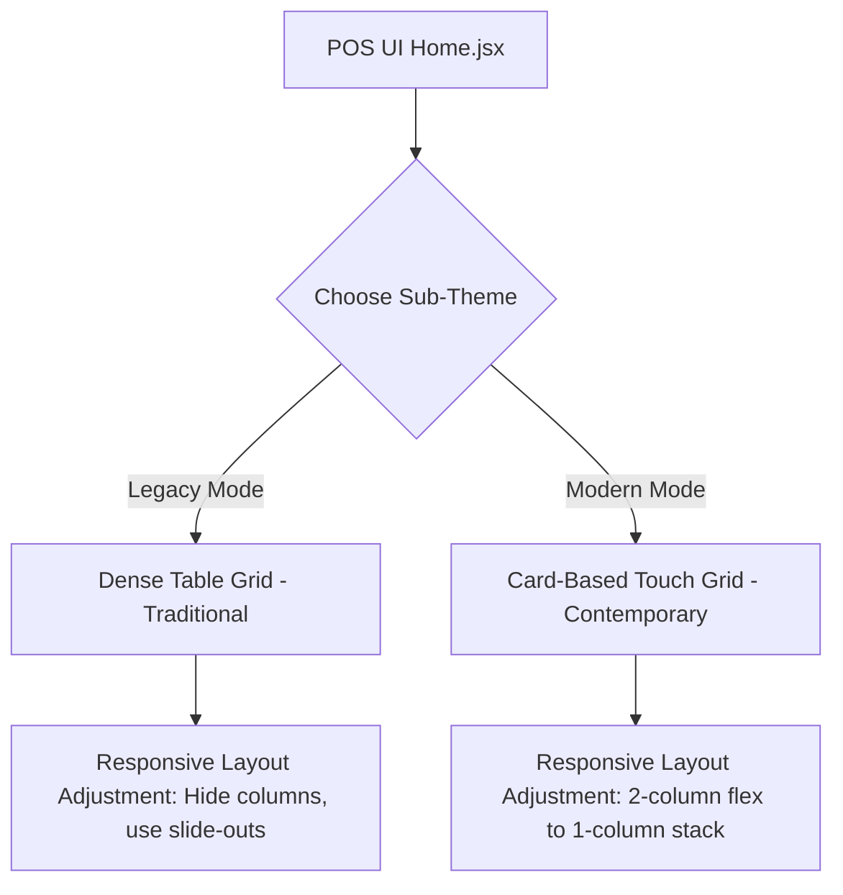

# 🗺️ Detailed Implementation Plan & Timeline: Retail POS Frontend

This plan outlines the task-by-task, screen-by-screen roadmap and exact timeline to deliver the requested enhancements. It includes centralizing the design, rendering `Home.jsx` fully responsive, developing Sales Orders (SO) and Delivery Notes (DN), adjusting the POS Invoicing flow, refining the Item screen, resolving top-bar navigation overflow bugs, and verifying local offline database setup in the desktop executable (`.exe`).

---

## 📅 Project Roadmap & Timeline Overview

Below is the structured breakdown of the remaining work across **5 targeted phases**, estimated at **13–18 development days**.

```mermaid
gantt
    title Retail POS Frontend Roadmap Timeline
    dateFormat  X
    axisFormat %d days
    
    section Phase 1: Global Style
    Centralize Design System & Token Integration :active, 0, 2
    Top Bar & Global Layout Overflow Fixes       :active, 2, 3
    
    section Phase 2: POS Billing
    Home.jsx Responsive Design (Modern Mode)     : 3, 5
    Home.jsx Responsive Design (Legacy Mode)     : 5, 7
    POS Invoicing Enhancements                   : 7, 8
    
    section Phase 3: Sales & Logistics
    Sales Order List & Create Modal              : 8, 10
    Sales Order Details & Workflows             : 10, 11
    Delivery Note List & Receipt Matching        : 11, 13
    
    section Phase 4: Inventory & Forms
    Item Screen Custom Box & Pricing Features     : 13, 15
    
    section Phase 5: Build & Local DB
    Local DB (.db / PouchDB) Local EXE Setup    : 15, 17
    End-to-End Packaged Validation               : 17, 18
```



| Phase | Core Target Area | Key Component File(s) | Estimated Duration |
| :--- | :--- | :--- | :--- |
| **Phase 1** | Global Aesthetics & Navigation | [index.css](file:///c:/kyle/Retail-POS-FE/src/index.css), [NavBar.jsx](file:///c:/kyle/Retail-POS-FE/src/Components/Nav/NavBar.jsx) | **2 - 3 Days** |
| **Phase 2** | `Home.jsx` Responsive Layouts & POS | [Home.jsx](file:///c:/kyle/Retail-POS-FE/src/Components/Headers/Home.jsx), [InvoiceList.jsx](file:///c:/kyle/Retail-POS-FE/src/Components/Headers/InvoiceList.jsx) | **3 - 4 Days** |
| **Phase 3** | Sales Orders & Delivery Notes | [SalesOrder.jsx](file:///c:/kyle/Retail-POS-FE/src/Components/Admin/SalesOrder.jsx), [DeliveryNoteList.jsx](file:///c:/kyle/Retail-POS-FE/src/Components/Admin/DeliveryNoteList.jsx) | **4 - 5 Days** |
| **Phase 4** | Item Screen Enhancements | [ItemList.jsx](file:///c:/kyle/Retail-POS-FE/src/Components/Admin/ItemList.jsx) | **2 - 3 Days** |
| **Phase 5** | Desktop packaging & Local DB Validation | [db.js](file:///c:/kyle/Retail-POS-FE/src/db.js), `electron-builder` config | **2 - 3 Days** |

---

## 🛠️ Screen-Wise Technical Details & Task Breakdowns

---

### Phase 1: Global Design System & Navigation Overflows
**Goal:** Establish a beautiful, unified design across all pages and resolve layout clipping caused by navigation elements.

> [!IMPORTANT]
> To preserve the look and feel, we will use modern curated CSS variables (HSL tailored colors, sleeker dark modes) rather than basic colors. Smooth transition classes and consistent glassmorphism shadows will be applied to all lists, tables, and modals.

#### Tasks:
1. **Central Design System Implementation:**
   - Define a shared semantic theme block in [index.css](file:///c:/kyle/Retail-POS-FE/src/index.css).
   - Standardize key color tokens (`--primary`, `--primary-hover`, `--background`, `--surface`, `--text`, `--text-muted`, `--border`).
   - Standardize responsive breakpoints (`--mobile: 480px`, `--tablet: 768px`, `--desktop: 1024px`, `--wide: 1200px`).
   - Implement global font scales (using Google Font *Outfit* or *Inter*) and micro-animations for buttons/inputs.
2. **Top Bar and Header Overflow Fixes:**
   - Modify the main layout container and [NavBar.jsx](file:///c:/kyle/Retail-POS-FE/src/Components/Nav/NavBar.jsx) layout to prevent layout clipping underneath.
   - Change `position: fixed` or `position: sticky` headers to use proper relative offsets with a flex container. This ensures that content is never covered or overflowed vertically on smaller displays.
   - Refactor user status indicators and online indicators into a responsive dropdown, collapsing to icons on mobile.

---

### Phase 2: POS Billing Screen (`Home.jsx`) Responsiveness
**Goal:** Transform the massive POS interface to look premium and feel highly usable on screens ranging from 8-inch tablets to wide-screen monitors.



#### Tasks:
1. **Modern Mode Responsiveness ([Home.jsx](file:///c:/kyle/Retail-POS-FE/src/Components/Headers/Home.jsx)):**
   - Apply CSS flex-wrapping to divide the screen into a **Bill Summary / Cart Panel** and an **Item Selection Grid** (converting from side-by-side to stacked panels on tablets and mobiles).
   - Implement touch-optimized gestures and horizontal sliding categories for easier mobile navigation.
2. **Legacy Mode Responsiveness:**
   - Simplify the detailed items table for mobile and narrow tablet widths.
   - Implement column toggle configurability, showing vital columns (Item, Qty, Price) and hiding less critical metadata dynamically.
   - Provide a persistent floating "Cart Summary" button that slides in full-screen on mobile when tapped.
3. **POS Invoicing Logic adjustments:**
   - Align item adding, pricing calculations, and tax computations with the custom box conversion patterns we solved in purchase receipts and invoices.

---

### Phase 3: Sales Order & Delivery Note Full Work
**Goal:** Implement fully functional Sales Order (SO) and Delivery Note (DN) tracking, creation, editing, and state mapping.

```
       [Sales Order]
             |
             v  (Convert / Match)
       [Delivery Note]
             |
             v  (Bill / Invoice)
       [Sales Invoice]
```

#### Tasks:
1. **Sales Order Full Implementation ([SalesOrder.jsx](file:///c:/kyle/Retail-POS-FE/src/Components/Admin/SalesOrder.jsx)):**
   - Design and build the Sales Order creation and edit modal to support advanced discount structures, taxes, and customer linking.
   - Add status workflows (Draft -> Submitted -> To Deliver -> Completed) powered by the `get_document_status_details` API.
   - Implement workflow transitions (Edit Draft, Submit, Delete, Cancel).
2. **Delivery Note Full Implementation ([DeliveryNoteList.jsx](file:///c:/kyle/Retail-POS-FE/src/Components/Admin/DeliveryNoteList.jsx)):**
   - Build out Delivery Note lists with visual badges highlighting the current state of deliveries.
   - Implement cascading data mapping to pre-fill Delivery Notes directly from a Sales Order (similar to how we map Purchase Invoices from Purchase Receipts).
   - Handle partial shipments by verifying original Sales Order item quantities vs already-delivered quantities.

---

### Phase 4: Item Screen Pricing & Box Upgrades
**Goal:** Enhance the core inventory screen to manage selling prices, barcode scanning, and box-to-piece package structures.

#### Tasks:
1. **Item Details Upgrades ([ItemList.jsx](file:///c:/kyle/Retail-POS-FE/src/Components/Admin/ItemList.jsx)):**
   - Incorporate box entry parameters (`custom_box_qty`, `custom_pieces_per_box`, `custom_box_price`) as toggleable settings directly inside the main item profile view.
   - Integrate barcode scanner search mapping so scanning instantly opens or highlights the target item.
2. **Stock Verification Integration:**
   - Display real-time warehouse-specific quantities in a detailed drawer.
   - Add shortcuts to trigger Quick Stock Ins directly from the item's context row menu.

---

### Phase 5: Desktop Packaging & Offline Local DB Sync
**Goal:** Verify local data synchronization, ensure database connections remain stable under SQLite/PouchDB/NeDB inside the compiled EXE shell, and prevent app crashes during offline operation.

> [!CAUTION]
> Package validation is high-risk because desktop environments have strict filesystem access permissions (especially under `Program Files`). We must verify that database read/writes target the user's localized `AppData` folder instead of the directory containing the compiled EXE.

#### Tasks:
1. **Verify Offline Sync & Local DB Setup ([db.js](file:///c:/kyle/Retail-POS-FE/src/db.js)):**
   - Test and ensure the desktop EXE reads/writes local data smoothly to the localized database.
   - Verify fallback logic when the network drops (cache API requests locally, queue them, and sync when online connection is restored).
2. **Packaged App Performance Tests:**
   - Execute test scripts in the desktop packaging shell to confirm that electron-native bindings compile properly on Windows.
   - Ensure the app launches quickly and gracefully handles backend network timeouts.

---

## 🙋‍♂️ Interactive Feedback & Refinements

To customize this plan specifically to your needs, please provide your feedback on these key details:

1. **POS Invoicing Adjustments:** What are the exact changes you need on the POS sales screen? (e.g., payment options, printer layout settings, customer-wise discount rate?).
2. **Item Screen Requirements:** Do you have specific layout fields you want to add or move? (e.g., supplier SL number field visibility?).
3. **EXE build toolchain:** Are you using Electron, Tauri, or a different native wrapper to generate your desktop Windows EXE build? This will help us tailor the database verification scripts perfectly.
